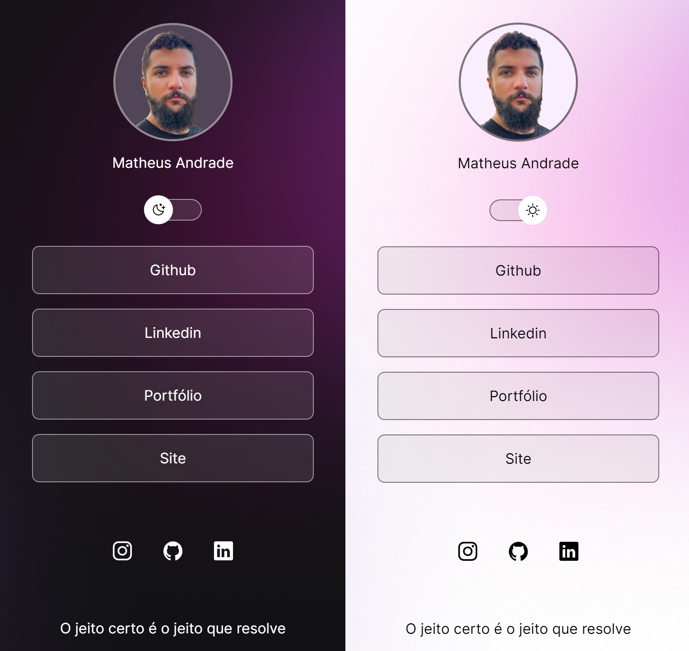

<h1 align="center"> Primeiro projeto </h1>

Projeto feito utilizando o curso Discover da Rocketseat, para ensino de tecnologias WEB 🚀🚀

  <a href="#-tecnologias">Tecnologias</a>&nbsp;&nbsp;&nbsp;|&nbsp;&nbsp;&nbsp;
  <a href="#-projeto">Projeto</a>&nbsp;&nbsp;&nbsp;|&nbsp;&nbsp;&nbsp;
  <a href="#-layout">Layout</a>&nbsp;&nbsp;&nbsp;|&nbsp;&nbsp;&nbsp;
  <a href="#memo-licença">Licença</a>

  

 

    

## 🚀 Tecnologias

Esse projeto foi desenvolvido com as seguintes tecnologias:

- HTML e CSS
- JavaScript
- Git e Github

## 💻 Projeto

Projeto feito para iniciar os meus estudos na area de progamação.

## 🔖 Layout

Você pode visualizar o layout do projeto através [DESSE LINK](https://www.figma.com/file/jCBYWC2jd1vx2jVjDKqjbG/DevLinks-•-Projeto-Discover-(Community)?type=design&node-id=10-620&t=6TowGhIfhO0t8FO2-0). É necessário ter conta no [Figma](https://figma.com) para acessá-lo.

---

Feito por Matheus Andrade utilizando o curso da Rocketseat :wave: